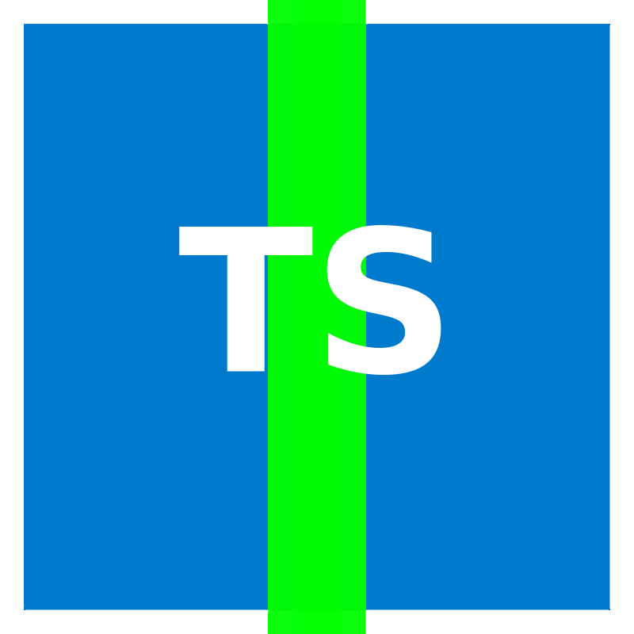

<div align="center">
<br>

<h1>Aligned TS</h1>
<strong>TypeScript SDK for Aligned Layer</strong>
</div>
<br>

Aligned TS is the TypeScript equivalent of the Aligned Layer Rust SDK.

## Table of Contents

- [Table of Contents](#table-of-contents)
- [Getting Started](#getting-started)
  - [Installation Documentation](#installation-documentation)
  - [Build locally](#build-locally)
  - [API Reference](#api-reference)
  - [Example](#example)

## Getting Started

AlignedTS is the TypeScript equivalent of the Aligned Layer Rust SDK.
It implements all the necessary communication with the Batcher, commitment of data verification data blobs and handles the Batchers response.

### Installation Documentation

### Build locally

In order to build this project locally, simply clone the repository and run

```sh
npm ci
npm run build
npm run test
```

### API Reference

Your main interaction with the SDK will be the `getAligned()` function, which initiates a new instance of the SDK that you can use to interact with a Batcher.

```ts
const getAligned: (address?: string) => Aligned;
```

`address?: string`: (Websocket) address of the Batcher you want to interact with. Default: `wss://batcher.alignedlayer.com`
returns `Aligned`: The Aligned SDK object, see below for more information.

<br>

`getAligned()` returns an object of `Aligned`, which you will use to interact with the Batcher and your verification data.

```ts
type Aligned = {
  submit: (
    verificationData: VerificationData,
    wallet: ethers.Wallet
  ) => Promise<AlignedVerificationData>;
  submitMultiple: (
    verificationData: Array<VerificationData>,
    wallet: ethers.Wallet
  ) => Promise<Array<AlignedVerificationData>>;
  verifyProofOnchain: (
    verificationData: AlignedVerificationData,
    chain: "devnet" | "holesky",
    provide: ethers.Provider
  ) => Promise<any>;
  getDefaultBatcherAddress: () => string;
  getCurrentBatcherAddress: () => string;
  setCurrentBatcherAddress: (address: string) => void;
  getExplorerLink: (batchMerkleRoot: Uint8Array) => string;
  getVerificationKeyCommitment: (vk: Buffer) => string;
};
```

```ts
submit: (verificationData: VerificationData, wallet: ethers.Wallet) =>
  Promise<AlignedVerificationData>;
```

Description: Submit verification data to the batcher, using a wallet to sign it. Returns verified data.

```ts
submitMultiple: (
  verificationData: Array<VerificationData>,
  wallet: ethers.Wallet
) => Promise<Array<AlignedVerificationData>>;
```

Description: Submits multiple verification data chunks, see `submit()` for more information.

```ts
verifyProofOnchain: (
  verificationData: AlignedVerificationData,
  chain: "devnet" | "holesky",
  provide: ethers.Provider
) => Promise<any>;
```

Description: Checks that your verification data has been verified on Ethereum.
_NOTE_ This function is still lacks parts of the implementation!

```ts
getDefaultBatcherAddress: () => string;
```

Description: Returns the default batcher (websocket) address.

```ts
getCurrentBatcherAddress: () => string;
```

Description: Returns the current batcher (websocket) address.

```ts
setCurrentBatcherAddress: (address: string) => void;
```

Description: Sets the current batcher (websocket) address.

```ts
getExplorerLink: (batchMerkleRoot: Uint8Array) => string;
```

Description: Given a Merkle root, returns the link to the Explorer of the batch that the data was verified in.

```ts
getVerificationKeyCommitment: (vk: Buffer) => string;
```

Description: Gets the commitment (Keccak256 hash) of a verification key.

### Example

The verification data you want to send to the Batcher depends on the type of proof system.
As an example, we are going to verify a SP1 proof. The example proof is available in the [test_files](./test_files/sp1/) folder.

First of all, import all the necessary functions and types.

```ts
import {
  ProvingSystemId,
  getAligned,
  Option,
  VerificationData,
} from "aligned-ts";
```

Secondly, we have to load the proof and ELF from our local file system, as well as specify some other parameters. Please note that the wallet private key in this case is a pre-funded Holeksy testnet private key!

```ts
const proof = fs.readFileSync("test_files/sp1/sp1_fibonacci.proof", null);
const elf = fs.readFileSync("test_files/sp1/sp1_fibonacci.elf", null);

const proofGeneratorAddress = "0x66f9664f97F2b50F62D13eA064982f936dE76657";
const wallet = new ethers.Wallet(
  "0x7d2647ad2e1f6c1dce5abe2b5c3b9c8ecfe959e40b989d531bbf6624ff1c62df"
);
```

After that, we can define the `VerificationData` object that we want to send:

```ts
let sp1Data: VerificationData = {
  provingSystem: ProvingSystemId.SP1, // the proving system, in this case SP1
  proof, // the proof
  publicInput: Option.None, // no public input in this case
  verificationKey: Option.None, // no verification key in this case
  vmProgramCode: Option.from(elf), // the vm program code (ELF)
  proofGeneratorAddress, // the proof generator address
};
```

Initiate the Aligned object:

```ts
const Alignment = getAligned();
```

and send the data to the batcher and wait for its response:

```ts
const alignedData = await Alignment.submit(sp1Data, wallet);
console.log(alignedData);
```

get the link to the explorer:

```ts
console.log(Alignment.getExplorerLink(alignedData[0].batchMerkleRoot));
// > https://explorer.alignedlayer.com/batches 0x065f95c19a9c0ccac97c482a864cab41db6a9d0b1652ccfad96d182df5d0ec73
```

For more examples take a look at the [tests](./tests/) folder!
